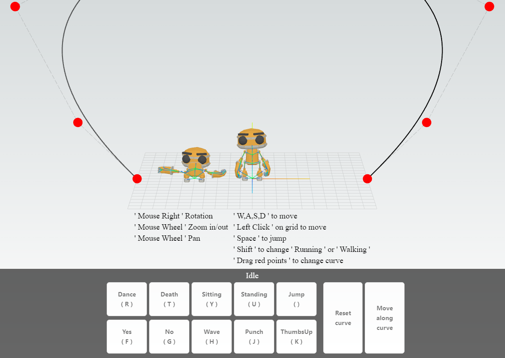

### Practice using
* next.js
* TypeScript
* three.js
    * animation
    * spline curves
* react hook
* react-redux
    * pass canvas data to ui component
    * pass ui component data to canvas
* gltf format

demo : [Robot animation](https://animation-sigma.vercel.app/)